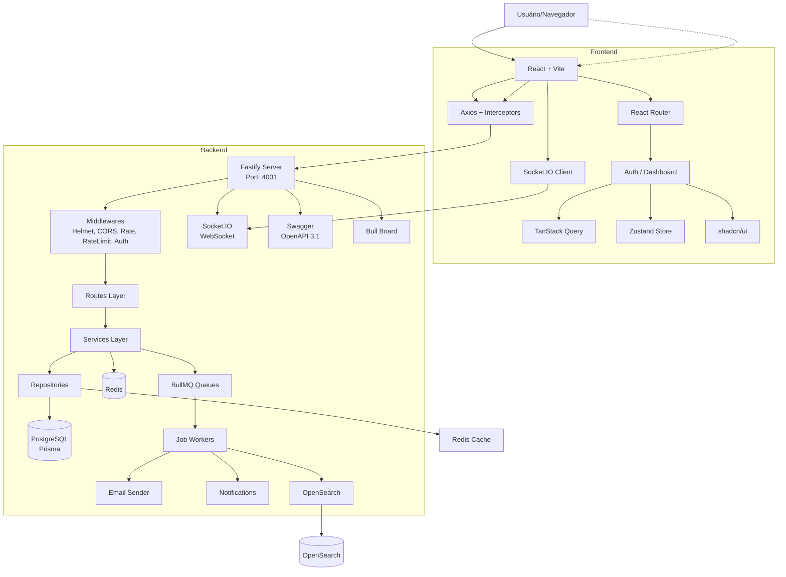

# Arquitetura Técnica

**Versão:** 1.0.0
**Última atualização:** 14/03/2026

---

## Visão Geral

Este é um **monorepo fullstack** que implementa uma aplicação moderna com stack completa para produção.

### Características Principais

| Aspecto | Detalhe |
|---------|---------|
| **Tipo** | Monorepo com backend e frontend separados |
| **Backend** | Fastify + TypeScript (porta 4001) |
| **Frontend** | React + Vite + TypeScript (porta 5173) |
| **Banco de Dados** | PostgreSQL 15 + Prisma ORM |
| **Cache/Sessão** | Redis 7 |
| **Search** | OpenSearch 2 |
| **Realtime** | Socket.IO |
| **Jobs/Queue** | BullMQ |
| **Containerização** | Docker + Docker Compose |

### Stack Tecnológica

```
Backend:
├── Fastify 5.x         - Framework HTTP (ultra-rápido)
├── Prisma 6.x          - ORM e migrations
├── Redis (ioredis)     - Cache e filas
├── BullMQ 5.x          - Sistema de filas
├── Socket.IO 4.x       - WebSockets
├── Zod 3.x             - Validação
├── JWT (fastify-jwt)   - Autenticação
└── Swagger/OpenAPI     - Documentação

Frontend:
├── React 19            - UI library
├── Vite 7.x            - Build tool
├── TypeScript 5.x      - Tipagem estática
├── TailwindCSS 3.x     - CSS utility-first
├── shadcn/ui           - Componentes acessíveis
├── React Router 7.x    - Routing
├── TanStack Query 5.x  - Server state
├── Zustand 5.x         - Client state
├── Axios 1.x           - HTTP client
├── Zod 4.x             - Validação forms
└── Socket.IO-client    - Realtime

Infraestrutura:
├── PostgreSQL 15       - Database
├── Redis 7             - Cache/Filas
├── OpenSearch 2        - Search engine
├── Adminer             - DB admin UI
└── Bull Board          - Dashboard filas
```

---

## Diagrama de Arquitetura



### Arquitetura em ASCII

```
                  ┌─────────────────────────────────────────┐
                  │            FRONTEND (Vite)               │
                  │    Porta: http://localhost:5173         │
                  ├─────────────────────────────────────────┤
                  │  ┌─────────────┐   ┌─────────────────┐ │
                  │  │   Features  │   │    Shared       │ │
                  │  │  - Auth     │   │  - Components   │ │
                  │  │  - Dashboard│   │  - Hooks        │ │
                  │  │  - Search   │   │  - Types        │ │
                  │  │  - API      │   │  - Utils        │ │
                  │  └──────┬──────┘   └────────┬────────┘ │
                  │         │                   │          │
                  │    ┌────▼───────────────────▼────┐    │
                  │    │  Zustand Stores           │    │
                  │    │  - Auth Store             │    │
                  │    │  - UI Store               │    │
                  │    └───────────┬───────────────┘    │
                  │                │                    │
                  │    ┌───────────▼───────────────────┐ │
                  │    │   Axios Client + Interceptors │ │
                  │    │   • JWT injection            │ │
                  │    │   • Error handling           │ │
                  │    └───────────┬───────────────────┘ │
                  └───────────────┼─────────────────────┘
                                  │ HTTPS/REST
                                  │ WebSocket
                    ┌─────────────▼─────────────────────────────┐
                    │           BACKEND (Fastify)                │
                    │        Porta: http://localhost:4001        │
                    ├────────────────────────────────────────────┤
                    │  ┌─────────────────────────────────────┐  │
                    │  │        MIDDLEWARES GLOBAIS          │  │
                    │  │  • Helmet (security headers)        │  │
                    │  │  • CORS (origins configuráveis)     │  │
                    │  │  • Rate Limit (100req/min)          │  │
                    │  │  • Rate Limit Redis (se disponível) │  │
                    │  │  • Multipart (file uploads)         │  │
                    │  │  • Static files (/uploads)          │  │
                    │  │  • JWT (verify token)               │  │
                    │  │  • Auth Plugins (getCurrentUser)    │  │
                    │  └─────────────────────────────────────┘  │
                    │                                           │
                    │  ┌───────────────┐  ┌────────────────────┐│
                    │  │   ROUTES      │  │     SOCKET.IO      ││
                    │  │  • /health    │  │  • Connection      ││
                    │  │  • /auth      │  │  • Rooms           ││
                    │  │  • /users     │  │  • Events (join,   │���
                    │  │  • /search    │  │    leave, chat)    ││
                    │  │  • /queues    │  └────────────────────┘│
                    │  └───────┬───────┘          │               │
                    │          │                  │               │
                    │    ┌─────▼──────────────────▼───────┐      │
                    │    │   SERVICES (Regras de Negócio) │      │
                    │    │  • UserService                │      │
                    │    │  • AuthService                │      │
                    │    │  • NotificationService        │      │
                    │    │  • SearchService              │      │
                    │    │  • Jobs (Email, Notify...)    │      │
                    │    └────────┬──────────────────────┘      │
                    │             │                             │
                    │    ┌────────▼──────────────────────┐      │
                    │    │  REPOSITORIES (Prisma)         │      │
                    │    │  • UserRepository             │      │
                    │    │  • PostRepository             │      │
                    │    └────────┬──────────────────────┘      │
                    │             │                             │
                    │    ┌────────▼──────────────────────┐      │
                    │    │    PRISMA CLIENT              │      │
                    │    └────────┬──────────────────────┘      │
                    │             │                             │
                    └─────────────┼─────────────────────────────┘
                                  │
              ┌───────────────────┼───────────────────┐
              │                   │                   │
         ┌────▼────┐       ┌─────▼────┐      ┌──────▼─────┐
         │Redis 6379│      │PostgreSQL│      │OpenSearch  │
         │         │      │          │      │   9200     │
         │ • Cache │      │ • Users  │      │ • Search   │
         │ • Sessao│      │ • Posts  │      │ • Analytics│
         │ • Filas │      └──────────┘      └────────────┘
         │ • PubSub│
         └─────────┘
```

---

## Camadas do Backend

### 1. Server Entry Point (`server.ts`)

Ponto de entrada principal que inicializa todos os serviços na ordem correta:

```typescript
// Ordem de inicialização:
1. Verifica se Redis está disponível
2. Cria Fastify com Zod provider
3. Registra middlewares globais
4. Configura Swagger (com basic-auth opcional)
5. Configura JWT
6. Registra Redis (se disponível)
7. Configura Bull Board + inicia workers
8. Registra todas as routes
9. Inicia servidor na porta configurada
10. Inicializa Socket.IO
```

**Porta padrão:** 4001 (configurável via `PORT`)

### 2. Middlewares

Localização: `src/middlewares/`

| Middleware | Função | Config |
|------------|--------|--------|
| `helmet` | Headers de segurança | CSP, HSTS, frameguard |
| `cors` | Controle de origins | `CORS_ORIGINS` env |
| `rateLimit` | Limite de requisições | 100/min (redis-backed) |
| `multipart` | Upload de arquivos | max 5 arquivos, limite configurável |
| `static` | Servir arquivos estáticos | `/uploads/*` |
| `jwt` | Verificação de token | Secret do JWT |
| `auth` | Plugins custom (getCurrentUserId, getCurrentUserRole) | - |

**Middleware Custom (`src/middlewares/auth.ts`):**

```typescript
// Adiciona métodos úteis na request:
request.getCurrentUserId()      → Promise<string>
request.getCurrentUserRole()    → Promise<string>
```

### 3. Routes (`src/http/routes/`)

#### Estrutura por Recurso

```
http/routes/
├── auth/
│   ├── authenticate.ts      # POST /auth/login
│   └── get-me.ts            # GET  /auth/me
├── user/
│   ├── create-user.ts       # POST /users
│   ├── list-users.ts        # GET  /users
│   ├── get-user.ts          # GET  /users/:id
│   ├── update-user.ts       # PUT  /users/:id
│   └── delete-user.ts       # DELETE /users/:id
├── health/
│   └── health-check.ts      # GET /health
├── search/
│   ├── search.ts            # GET /search (OpenSearch)
│   ├── geo-search.ts        # GET /geo-search
│   ├── autocomplete.ts      # GET /autocomplete
│   └── analytics.ts         # GET /analytics
├── admin/
│   ├── index-document.ts    # POST /admin/search/index
│   ├── bulk-index.ts        # POST /admin/search/bulk
│   └── delete-document.ts   # DELETE /admin/search/:id
├── queue/
│   └── queue-routes.ts      # POST /queues/add, GET /queues/status
└── _errors/                 # Erros customizados
```

#### Padrão de Routes

```typescript
import { z } from 'zod';
import { fastifyRoute } from 'fastify-type-provider-zod';
import { userService } from '@/services/user-service';
import { createUserSchema } from '@/lib/validators/user';
import { NotFoundError } from '@/http/routes/_errors';

const createUserRoute = fastifyRoute({
  method: 'POST',
  url: '/users',
  schema: {
    body: createUserSchema,  // Zod validation automática
    response: {
      201: z.object({ id: z.string(), email: z.string(), name: z.string() }),
    },
  },
  handler: async (request, reply) => {
    const data = request.body;  // Já validado pelo Zod
    const user = await userService.create(data);
    return reply.status(201).send(user);
  },
});

export { createUserRoute as createUser };
```

### 4. Services (`src/services/`)

Camada de regras de negócio, sem conhecer Fastify ou HTTP.

```
services/
├── user-service.ts     # User business logic
├── auth-service.ts     # Authentication logic
├── notification/       # Notificações (email, push, in-app)
└── jobs/               # Job processors
    ├── worker/
    │   ├── example-worker.ts
    │   ├── email-worker.ts
    │   ├── notification-worker.ts
    │   └── worker-manager.ts
    ├── queue/
    │   └── queue-manager.ts     # Centraliza todas as filas
    └── scheduler/               # Jobs agendados
```

**Exemplo de Service:**

```typescript
export const userService = {
  async create(data: CreateUserDTO) {
    // Validações e regras de negócio
    const existing = await userRepository.findByEmail(data.email);
    if (existing) {
      throw new ConflictError('Email já cadastrado');
    }

    // Hash da senha
    const hashedPassword = await bcrypt.hash(data.password, 12);

    // Cria usuário
    const user = await userRepository.create({
      ...data,
      password: hashedPassword,
    });

    // Emite evento (pode ser usado para webhooks)
    await this.emitUserCreated(user);

    return userService.toPublicUser(user);
  },

  async authenticate(email: string, password: string) {
    const user = await userRepository.findByEmail(email);
    if (!user || !user.isActive) {
      throw new UnauthorizedError('Credenciais inválidas');
    }

    const valid = await bcrypt.compare(password, user.password);
    if (!valid) {
      throw new UnauthorizedError('Credenciais inválidas');
    }

    // Atualiza lastLoginAt (fire-and-forget)
    userRepository.updateLastLogin(user.id);

    return { user: toPublicUser(user), token: createJWT(user) };
  },
};
```

### 5. Repositories (`src/services/` ou `src/lib/prisma.ts`)

Acesso direto ao banco via Prisma. Stateless, apenas operações CRUD.

```typescript
export const prisma = new PrismaClient({
  log: process.env.NODE_ENV === 'development' ? ['query', 'error', 'warn'] : ['error'],
});

// Repository pattern
export const userRepository = {
  findById(id: string) {
    return prisma.user.findUnique({ where: { id } });
  },

  findByEmail(email: string) {
    return prisma.user.findUnique({ where: { email } });
  },

  create(data: Prisma.UserCreateInput) {
    return prisma.user.create({ data });
  },

  update(id: string, data: Prisma.UserUpdateInput) {
    return prisma.user.update({ where: { id }, data });
  },

  delete(id: string) {
    return prisma.user.delete({ where: { id } });
  },

  // Exemplo com transação
  async transferFunds(from: string, to: string, amount: number) {
    return await prisma.$transaction(async (tx) => {
      await tx.user.update({ where: { id: from }, data: { balance: { decrement: amount } } });
      await tx.user.update({ where: { id: to }, data: { balance: { increment: amount } } });
      return true;
    });
  },
};
```

**⚠️ IMPORTANTE:** O schema Prisma está **SEM ÍNDICES**. Adicione conforme necessário:

```prisma
model User {
  id        String   @id @default(cuid())
  email     String   @unique
  // Adicione índices:
  @@index([email])
  @@index([createdAt])
  @@index([role])
}

model Post {
  id        String   @id @default(cuid())
  title     String
  authorId  String
  // Índices compostos:
  @@index([authorId, createdAt])
  @@index([published, createdAt])
}
```

### 6. Libs (`src/lib/`)

```
lib/
├── env.ts              # Config e validação de ENV (Zod)
├── prisma.ts           # Singleton do PrismaClient
├── redis/
│   ├── index.ts       # Redis singleton (FastifyRedis)
│   ├── redis-instance.ts    # Wrapper compartilhado
│   └── redis-service.ts     # API de operações (get, set, hash)
├── jwt.ts              # Funções createJWT, verifyJWT
├── crypto.ts           # bcrypt, hash, verify
├── validators/         # Schemas Zod para todas as entidades
│   ├── user.ts
│   ├── post.ts
│   └── auth.ts
└── errors.ts           # AppError base class
```

**Exemplo de `env.ts`:**

```typescript
const envSchema = z.object({
  NODE_ENV: z.enum(['development', 'production', 'test']),
  PORT: z.string().default('4001'),
  DATABASE_URL: z.string().url(),
  JWT_SECRET: z.string().min(32),
  REDIS_URL: z.string().default('localhost'),
  REDIS_PORT: z.string().default('6379'),
  CORS_ORIGINS: z.string().optional(),
  // ...
});

export const env = envSchema.parse(process.env);
```

---

## Camadas do Frontend

### 1. Features Organization

```
src/features/
├── auth/                          # Autenticação
│   ├── api.ts                    # API calls (login, register, getMe)
│   ├── store.ts                  # Zustand store (auth state)
│   ├── types.ts                  # Auth types
│   ├── components/
│   │   ├── LoginForm.tsx
│   │   ├── RegisterForm.tsx
│   │   └── ProtectedRoute.tsx    # Wrapper de proteção de rotas
│   └── hooks/
│       └── use-auth.ts           # Lógica de autenticação
│
├── dashboard/                    # Dashboard
│   ├── api.ts                    # Dashboard data fetching
│   ├── types.ts                  # Dashboard types
│   └── components/
│       └── DashboardChart.tsx
│
└── search/                       # Funcionalidade de busca
    ├── api.ts
    ├── hooks/
    │   ├── use-search.ts
    │   └── use-autocomplete.ts
    ├── components/
    │   ├── SearchBar.tsx
    │   ├── SearchResults.tsx
    │   └── SearchPagination.tsx
    ├── store/
    │   └── search-store.ts
    └── types/
        └── search-types.ts
```

**Cada feature segue o padrão:**

```typescript
// feature/auth/api.ts
export const authApi = {
  login: async (input) => await apiClient.post('/sessions/password', input),
  register: async (input) => await apiClient.post('/auth/register', input),
  getMe: async () => await apiClient.get('/me'),
  logout: async () => {
    localStorage.removeItem('token');
    window.location.href = '/login';
  },
};
```

### 2. Shared Components

```
src/shared/
├── components/
│   ├── ui/                       # shadcn/ui components
│   │   ├── button.tsx
│   │   ├── input.tsx
│   │   ├── card.tsx
│   │   └── skeleton.tsx
│   ├── layout/                   # Layout components
│   │   ├── AppLayout.tsx
│   │   ├── Header.tsx
│   │   └── Sidebar.tsx
│   └── editor/                   # Rich text editor (TipTap)
├── hooks/
│   ├── use-debounce.ts
│   └── use-local-storage.ts
├── lib/
│   ├── utils.ts                  # cn() função (tailwind-merge)
│   ├── constants.ts
│   └── api-client.ts            # Axios config + interceptors
└── types/
    └── common.ts                 # PaginatedResponse, ApiError
```

### 3. State Management

#### Zustand (Client State)

```typescript
// src/features/auth/store.ts
import { create } from 'zustand';

interface AuthState {
  user: User | null;
  token: string | null;
  isLoading: boolean;
  setAuth: (user: User, token: string) => void;
  logout: () => void;
}

export const useAuthStore = create<AuthState>((set) => ({
  user: null,
  token: localStorage.getItem('token'),
  isLoading: false,
  setAuth: (user, token) => {
    localStorage.setItem('token', token);
    set({ user, token });
  },
  logout: () => {
    localStorage.removeItem('token');
    set({ user: null, token: null });
  },
}));
```

#### TanStack Query (Server State)

```typescript
// src/features/dashboard/hooks/use-dashboard.ts
import { useQuery } from '@tanstack/react-query';

export function useDashboard() {
  return useQuery({
    queryKey: ['dashboard'],
    queryFn: async () => {
      const { data } = await apiClient.get('/dashboard');
      return data;
    },
    staleTime: 5 * 60 * 1000, // 5 minutos
    cacheTime: 10 * 60 * 1000,
  });
}
```

### 4. Routing

```typescript
// src/app/routes.tsx
import { createBrowserRouter, Navigate } from 'react-router-dom';

export const router = createBrowserRouter([
  { path: '/login', element: <LoginPage /> },
  { path: '/register', element: <RegisterPage /> },
  {
    path: '/',
    element: <ProtectedRoute><AppLayout /></ProtectedRoute>,
    children: [
      { index: true, element: <Navigate to="/dashboard" replace /> },
      { path: 'dashboard', element: <DashboardPage /> },
      { path: 'profile', element: <ProfilePage /> },
    ],
  },
  { path: '*', element: <Navigate to="/dashboard" replace /> },
]);
```

### 5. API Client

```typescript
// src/shared/lib/api-client.ts
import axios from 'axios';

const API_URL = import.meta.env.VITE_API_URL || 'http://localhost:4001';

export const apiClient = axios.create({
  baseURL: API_URL,
  timeout: 30000,
  headers: { 'Content-Type': 'application/json' },
});

// Request interceptor - adiciona JWT
apiClient.interceptors.request.use((config) => {
  const token = localStorage.getItem('token');
  if (token) {
    config.headers.Authorization = `Bearer ${token}`;
  }
  return config;
});

// Response interceptor - trata 401
apiClient.interceptors.response.use(
  (response) => response,
  (error) => {
    if (error.response?.status === 401) {
      localStorage.removeItem('token');
      window.location.href = '/login';
    }
    return Promise.reject(error);
  }
);
```

---

## Fluxos de Dados

### 1. Autenticação

```
┌─────────┐
│ Login   │
│ Form    │
└────┬────┘
     │ useAuth.login(credentials)
     ↓
┌──────────────────────────────────────────────┐
│ FE: authApi.login() → POST /sessions/password│
└──────────────────────────────────────────────┘
     │
     ↓
┌──────────────────────────────────────────────┐
│ BE: POST /auth/login                        │
│ 1. Valida input (Zod)                       │
│ 2. UserService.authenticate()              │
│ 3. Prisma: find user by email              │
│ 4. bcrypt.compare(password)                │
│ 5. Gerar JWT (payload: { sub, role })      │
│ 6. Return { user, token }                  │
└──────────────────────────────────────────────┘
     │ { user, token }
     ↓
┌──────────────────────────────────────────────┐
│ FE: store.setAuth(user, token)              │
│ - localStorage.setItem('token', token)      │
│ - set Zustand state                        │
└──────────────────────────────────────────────┘
     │
     ↓
┌──────────────────────────────────────────────┐
│ Outras requisições:                         │
│ axios interceptor adiciona Authorization   │
│ header: Bearer {token}                      │
└──────────────────────────────────────────────┘
```

**JWT Payload:**

```json
{
  "sub": "user-id-cuid",
  "email": "user@example.com",
  "role": "ADMIN",
  "iat": 1700000000,
  "exp": 1700003600  // 1 hora
}
```

### 2. CRUD Completo

```
Usuario           Frontend                 Backend
┌─────────────┐   ┌────────────┐        ┌──────────────┐
│ Dashboard   │──▶│ useQuery   │──────▶│ GET /users   │
│ listing     │   │ { data }   │        │              │
└─────────────┘   └────────────┘        └──────────────┘
                                                │
                                                ▼
                                       ┌────────────────────┐
                                       │ Routes Layer       │
                                       │ 1. Zod validation  │
                                       │ 2. Auth middleware │
                                       └─────────┬──────────┘
                                                 │
                                                 ▼
                                       ┌────────────────────┐
                                       │ Services           │
                                       │ userService.list() │
                                       └─────────┬──────────┘
                                                 │
                                                 ▼
                                       ┌────────────────────┐
                                       │ Repositories       │
                                       │ prisma.user.findMany│
                                       └─────────┬──────────┘
                                                 │
                                                 ▼
                                       ┌────────────────────┐
                                       │ PostgreSQL         │
                                       │ SELECT * FROM users │
                                       └────────────────────┘
```

### 3. Realtime (Socket.IO)

```
Frontend                          Backend
┌─────────────────────────┐       ┌──────────────────────────┐
│ socket = io('http://...'│──────▶│ Server.listen(4001)      │
│ io.connect()            │       │                          │
└─────────────────────────┘       │ Socket.IO setup         │
                                  │ - CORS config           │
                                  │ - Auth middleware       │
                                  └──────────┬───────────────┘
                                             │
                                ┌────────────▼────────────┐
                                │ Socket Manager          │
                                │ - store connections     │
                                │ - manage rooms          │
                                │ - emit to room          │
                                └────────────┬────────────┘
                                             │
Middleware verifica JWT ───────────────────▶│
                                             │
┌─────────────────────────┐      ┌──────────▼──────────┐
│ Frontend                │      │ Handlers:           │
│ socket.emit('join', ...)│─────▶│ - join-room        │
│                         │      │ - leave-room       │
│ socket.on('message')    │◀─────┤ - broadcast        │
└─────────────────────────┘      └────────────────────┘
```

**Socket Eventos:**

```typescript
// Servidor
socket.on('room:join', ({ roomId }) => {
  socket.join(roomId);
  socket.to(roomId).emit('user:joined', { userId: socket.id });
});

socket.on('room:leave', ({ roomId }) => {
  socket.leave(roomId);
});

socket.on('message', ({ roomId, content }) => {
  socket.to(roomId).emit('message', { from: socket.id, content });
});
```

### 4. Jobs (BullMQ)

```
┌─────────────┐
│   API       │  POST /queues/add
│   Route     │  { queue: 'email', name: 'welcome', data: {...} }
└──────┬──────┘
       │
       ▼
┌────────────────────────────┐
│ queueManager.addJob()      │
│ - getQueue(name)           │
│ - queue.add(jobName, data) │
└────────────┬───────────────┘
             │
             ▼
      ┌────────────┐
      │   Redis    │ ◄── BullMQ armazena jobs em filas
      │   Queue    │     (listas Redis)
      └────────────┘
             │
             ▼
      ┌────────────┐
      │  Workers   │  ← startAllWorkers() em server.ts
      │  (PID)     │     Pool: concurrency configurável
      └──────┬─────┘
             │
    ┌────────┴────────┐
   Jobs processados   │
    em paralelo       │
    └─────────────────┘

Bull Board: http://localhost:4001/queues
┌─────────────────────────────────────┐
│ Dashboard:                          │
│ • Filas (email, notification, ...) │
│ • Jobs pendentes, ativos, completos│
│ • Retry, failed, delayed          │
│ • Logs                             │
└─────────────────────────────────────┘
```

**Worker Exemplo:**

```typescript
// worker-manager.ts
export async function startAllWorkers() {
  await Promise.all([
    emailWorker.start(),
    notificationWorker.start(),
    processingWorker.start(),
  ]);
}

// email-worker.ts
export const emailWorker = {
  start: async (): Promise<Worker | null> => {
    return new Worker(
      QUEUE_NAMES.EMAIL,
      async (job) => {
        switch (job.name) {
          case 'send-welcome':
            await sendWelcomeEmail(job.data.userId);
            break;
          case 'send-notification':
            await sendNotificationEmail(job.data);
            break;
        }
      },
      { connection, concurrency: 5 }
    );
  },
};
```

---

## Segurança

### JWT (Stateless)

- **Secret:** `JWT_SECRET` (mínimo 32 caracteres)
- **Expiração:** 1 hora padrão (configurável)
- **Payload:** `{ sub: userId, role: UserRole, iat, exp }`
- **Refresh tokens:** NÃO implementado (RISCO - considere adicionar)

```typescript
// Create token
const token = jwt.sign(
  { sub: user.id, role: user.role },
  env.JWT_SECRET,
  { expiresIn: '1h' }
);

// Verify
const decoded = await request.jwtVerify<{ sub: string; role?: string }>();
```

### Senhas

- **Hash:** bcrypt (10-12 rounds)
- **Complexidade:** mínimo 6 caracteres (melhore isso!)

```typescript
const hashed = await bcrypt.hash(password, 12);
const valid = await bcrypt.compare(password, hashed);
```

### Headers de Segurança (Helmet)

```typescript
app.register(fastifyHelmet, {
  contentSecurityPolicy: {
    directives: {
      defaultSrc: ["'self'"],
      styleSrc: ["'self'", "'unsafe-inline'"], // Tailwind precisa
      scriptSrc: ["'self'"],
      imgSrc: ["'self'", "data:", "https:"],
    },
  },
  hsts: {
    maxAge: 31536000, // 1 ano
    includeSubDomains: true,
    preload: true,
  },
  frameguard: { action: 'deny' },  // Protege contra clickjacking
  dnsPrefetchControl: { allow: false },
});
```

### Rate Limiting

```typescript
app.register(fastifyRateLimit, {
  max: 100,              // 100 requisições
  timeWindow: '1 minute',
  redis: redisAvailable ? app.redis : undefined,  // Se Redis disponível
  keyGenerator: (request) => request.ip,
});
```

### CORS

```typescript
const allowedOrigins = env.CORS_ORIGINS
  ? env.CORS_ORIGINS.split(',')
  : env.NODE_ENV === 'production'
    ? []
    : ['http://localhost:5173'];
```

### Upload de Arquivos

```typescript
app.register(fastifyMultipart, {
  limits: {
    fileSize: env.MAX_FILE_SIZE || '10mb',
    files: 5,
    fields: 50,
  },
});
```

### Vulnerabilidades Conhecidas

| Vulnerabilidade | Status | Descrição |
|-----------------|--------|-----------|
| **RBAC completo** | ❌ NÃO IMPLEMENTADO | Apenas roles em JWT, sem middleware de autorização |
| **Refresh tokens** | ❌ NÃO IMPLEMENTADO | JWT expiram, mas não há renovação |
| **Permission checks** | ⚠️ PARCIAL | Apenas rota `/auth/me` verifica ownership |
| **Input sanitization** | ⚠️ PARCIAL | Zod valida schema, mas não sanitiza XSS |
| **SQL Injection** | ✅ PROTEGIDO | Prisma usa parâmetros preparados |
| **CSRF** | ⚠️ PARCIAL | JWT + same-origin supplier, mas sem CSRF tokens |

---

## Padrões e Convenções

### Error Handling Centralizado

```typescript
// Erros customizados (src/http/routes/_errors/)
class BadRequestError extends Error { statusCode = 400; }
class UnauthorizedError extends Error { statusCode = 401; }
class ForbiddenError extends Error { statusCode = 403; }
class NotFoundError extends Error { statusCode = 404; }
class ConflictError extends Error { statusCode = 409; }
class ValidationError extends Error { statusCode = 422; }

// errorHandler.ts processa:
// - hasZodFastifySchemaValidationErrors (Fastify validation) → 400
// - ZodError (validação manual) → 422
// - Erros customizados → respectivo status code
// - Outros → 500 (logs em dev, minimal em prod)
```

### Logging

```typescript
// Desenvolvimento
console.error('Unhandled error:', error);
console.error('Stack:', error.stack);

// Produção (sem sensitive data)
console.error(`[ISO] Error: ${error.name} - ${error.message}`);
```

**Recomendação:** Migre para um logger estruturado como Winston/Pino:

```typescript
import pino from 'pino';
const logger = pino({
  level: process.env.NODE_ENV === 'production' ? 'info' : 'debug',
  transport: process.env.NODE_ENV === 'production' ? { target: 'pino-pretty' } : undefined,
});

logger.error({ err, requestId }, 'Request failed');
```

### Validação em Camadas

```
┌─────────────────────────────────────────────┐
│ 1. Fastify + Zod (Route schemas)          │
│    • Validação automática de body/params  │
│    • 400 Bad Request em falhas            │
├─────────────────────────────────────────────┤
│ 2. Service layer (manual Zod)             │
│    • Regras de negócio complexas          │
│    • Validações cross-field              │
├─────────────────────────────────────────────┤
│ 3. Prisma (database constraints)          │
│    • Unique, foreign keys                 │
│    • NOT NULL, default values            │
└─────────────────────────────────────────────┘
```

### Transações

Use transações para operações atômicas:

```typescript
// Sem transação (RUIM):
await prisma.user.update({ where: { id: from }, data: { balance: { decrement: amount } } });
await prisma.user.update({ where: { id: to }, data: { balance: { increment: amount } } });

// Com transação (BOM):
await prisma.$transaction(async (tx) => {
  await tx.user.update({ where: { id: from }, data: { balance: { decrement: amount } } });
  await tx.user.update({ where: { id: to }, data: { balance: { increment: amount } } });
});
```

---

## Decisões Técnicas

### Por que Fastify?

- **Performance:** ~2x mais rápido que Express (benchmarks consagrados)
- **Schema-first:** Validação integrada com Zod via fastify-type-provider-zod
- **TypeScript-first:** Tipagem completa e inferência automática
- **Plugins:** Ecossistema rico (Swagger, Redis, Rate Limit, etc.)
- **Fausto:** encapsulamento de plugins atraves do fastify-plugin garante isolamento

### Por que BullMQ?

- **Baseado em Redis:** Sem dependência de banco adicional
- **Delay jobs:** Agendamento flexível
- **Retry com backoff:** Automático com estratégias configuráveis
- **Dashboard:** Bull Board integrado
- **Concurrency:** Controle de workers concorrentes
- **Priorities:** Sistema de prioridade de jobs

### Porque shadcn/ui?

- **Acessibilidade:** Baseado em Radix UI (WCAG AA)
- **Customizável:** Variáveis CSS + Tailwind
- **Tree-shakable:** Só importe o que usar
- **Dark mode:** Suporte nativo
- **Type-safe:** TypeScript completo

### Por que Zustand (e não Redux)?

- **Simplicidade:** API minimalista
- **Boilerplate zero:** Sem actions, reducers, dispatch
- **Type-safe:** Tipagem nativa
- **Sem providers:** Não força árvore React
- **Small:** ~1KB minificado

### Por que TanStack Query (e não Redux/Context)?

- **Server state:** Trata caching, revalidação,加载 state
- **Automatic caching:** Memoização de respostas
- **Background updates:** Stale-while-revalidate pattern
- **Pagination/Infinite queries:** Built-in
- **Devtools:** Excelente para debug

---

## Performance

### Redis Cache

**Uso atual:** Cache das configurações e sessões, filas BullMQ.

```typescript
// Exemplo de cache em service
async getUserWithCache(userId: string) {
  const cacheKey = `user:${userId}`;
  const cached = await redisService.getValue(cacheKey);

  if (cached) {
    return JSON.parse(cached);
  }

  const user = await userRepository.findById(userId);
  if (user) {
    await redisService.setValue(cacheKey, JSON.stringify(user), 3600); // 1h
  }
  return user;
}
```

**Padrão Cache-Aside:** Read-through, write-through, invalidação por TTL.

### Database Indexes (⚠️ FALTAM!)

O schema Prisma **NÃO TEM ÍNDICES DEFINIDOS**. Adicione:

```prisma
model User {
  id           String   @id @default(cuid())
  email        String   @unique
  role         UserRole @default(USER)
  isActive     Boolean  @default(true)
  createdAt    DateTime @default(now()) @map("created_at")
  updatedAt    DateTime @updatedAt @map("updated_at")

  // ÍNDICES CRÍTICOS:
  @@index([email])                    // Busca por email (login)
  @@index([role])                     // Filtro por role (admin panel)
  @@index([createdAt])                // Ordenação, relatórios
  @@map("users")
}

model Post {
  id        String   @id @default(cuid())
  title     String
  authorId  String
  published Boolean  @default(false)
  createdAt DateTime @default(now())

  @@index([authorId])                         // Posts do autor
  @@index([published, createdAt])             // Posts publicados recentes
  @@index([createdAt])                       // Ordenação global
  @@map("posts")
}
```

### Query Optimization (N+1)

Problema N+1:

```typescript
// RUIM - causa N+1 queries
const posts = await prisma.post.findMany();
const postsWithAuthors = await Promise.all(
  posts.map(async (post) => {
    const author = await prisma.user.findUnique({ where: { id: post.authorId } });
    return { ...post, author };
  })
);

// BOM - eager loading
const posts = await prisma.post.findMany({
  include: { author: { select: { id: true, name: true, email: true } } },
});
```

### Lazy Loading Frontend

```typescript
// Apenas carregue quando necessário
const DashboardPage = lazy(() =>
  import('@/features/dashboard').then(m => ({ default: m.DashboardPage }))
);
```

---

## Escalabilidade

### Horizontal Scaling (Stateless Backend)

O backend é stateless por design:

```
┌────────────┐      Load Balancer (nginx/ELB)
│  API #1    │◀────┬─────────────────────────────┐
└────────────┘      │                              │
                    │                              ▼
┌────────────┐      │                    ┌────────────────┐
│  API #2    │◀─────┤                    │    API #N     │
└────────────┘      │                    └────────────────┘
                    │
                    ▼
            ┌────────────────┐
            │ Shared Redis   │ ◄── Cache + Sessions + Queues
            └────────────────┘
                    │
                    ▼
            ┌────────────────┐
            │   PostgreSQL   │ ◄── Single writers, read replicas
            └────────────────┘
```

**Pré-requisitos:**
- Redis compartilhado (cluster mode para alta disponibilidade)
- Banco principal + read replicas (configure `DATABASE_URL` e `DATABASE_READ_URL`)
- JWT stateless (não precisa de sessão server-side)
- Uploads em S3/MinIO (não local filesystem)

### Redis Shared Cache

```
┌──────────┐   Read  ┌─────────────┐   Write  ┌──────────┐
│ API Node │────────▶│   Redis     │◀─────────│ API Node │
│    #1    │◀───────┤   Cluster   │─────────▶│    #N    │
└──────────┘        │   7.0       │          └──────────┘
                    └─────────────┘
                        ▲  ▲
                        │  │
                 Sentinel/Cluster
```

Config: `REDIS_CLUSTER_NODES` para cluster, ou sentinel HA.

### Database Read Replicas

```typescript
// two datasources in Prisma schema
datasource db {
  provider = "postgresql"
  url      = env("DATABASE_URL")      // Writer
}

datasource db_read {
  provider = "postgresql"
  url      = env("DATABASE_READ_URL") // Reader (readonly)
}

// Usage for read operations:
const readPrisma = new PrismaClient({ datasource: 'db_read' });
const posts = await readPrisma.post.findMany(); // Lê da réplica
```

### Queue Workers Scaling

```bash
# Scale workers horizontalmente
docker-compose up --scale worker-email=3 worker-notification=2

# Configurar concurrency por worker
concurrency: 10  # cada worker processa até 10 jobs simultâneos
```

---

## Monitoração

### Health Check

```
GET /health

Response 200:
{
  "status": "ok",
  "timestamp": "2025-01-14T10:00:00.000Z",
  "checks": {
    "database": "ok",
    "redis": "ok",
    "opensearch": "ok"
  },
  "uptime": 3600,
  "version": "1.0.0"
}
```

### Metrics (futuro)

Implemente Prometheus metrics:

```typescript
import client from 'prom-client';

const httpRequestDurationMicroseconds = new client.Histogram({
  name: 'http_request_duration_ms',
  help: 'Duration of HTTP requests in ms',
  labelNames: ['method', 'route', 'code'],
  buckets: [50, 100, 200, 300, 400, 500, 750, 1000, 2000, 3000],
});

app.addHook('onRequest', (req, reply, done) => {
  req.startTime = Date.now();
  done();
});

app.addHook('onResponse', (req, reply) => {
  const duration = Date.now() - req.startTime;
  httpRequestDurationMicroseconds
    .labels(req.method, req.routePath, reply.code.toString())
    .observe(duration);
});
```

### Logs

- **Development:** Pretty print no console
- **Production:** JSON structured logs

```json
{
  "timestamp": "2025-01-14T10:00:00.000Z",
  "level": "error",
  "message": "Request failed",
  "requestId": "uuid",
  "userId": "user-id",
  "path": "/api/users",
  "error": "ValidationError",
  "stack": "..."
}
```

---

## Deploy

### EasyPanel

1. **Dockerfile backend:** `backend-boilerplate/Dockerfile`
2. **Dockerfile frontend:** `frontend-boilerplate/Dockerfile` (multi-stage build)
3. **Docker Compose:** Raiz `docker-compose.yml`

```yaml
# docker-compose.yml
services:
  postgres:
    image: postgres:15
    ports: ["5433:5432"]
  redis:
    image: redis:7
    ports: ["6379:6379"]
  opensearch:
    image: opensearchproject/opensearch:2
    ports: ["9200:9200"]
```

### Variáveis de Ambiente

```bash
# .env (produção)
NODE_ENV=production
PORT=4001
DATABASE_URL=postgresql://user:pass@db:5432/boilerplate
JWT_SECRET=super-seguro-de-pelo-menos-32-caracteres
REDIS_URL=redis
REDIS_PORT=6379
CORS_ORIGINS=https://meudominio.com,https://app.meudominio.com
```

### Frontend Build

```bash
cd frontend-boilerplate
npm run build  # Vite build em dist/
```

**Multi-stage Dockerfile:**

```dockerfile
# Build stage
FROM node:20-alpine AS builder
WORKDIR /app
COPY package*.json ./
RUN npm ci
COPY . .
RUN npm run build

# Production stage
FROM nginx:alpine
COPY --from=builder /app/dist /usr/share/nginx/html
COPY nginx.conf /etc/nginx/conf.d/default.conf
EXPOSE 80
CMD ["nginx", "-g", "daemon off;"]
```

### CI/CD Recomendado

```yaml
# .github/workflows/ci.yml
name: CI
on: [push, pull_request]
jobs:
  test:
    runs-on: ubuntu-latest
    steps:
      - uses: actions/checkout@v3
      - uses: actions/setup-node@v3
      - run: make install
      - run: make test
      - run: make lint
  build:
    needs: test
    steps:
      - run: make build
```

---

## Troubleshooting

### Redis Connection Refused

```bash
# Verifique se está rodando
docker-compose ps

# Logs
docker-compose logs redis

# Conecte manualmente
redis-cli -h localhost -p 6379 ping  # Deve retornar PONG
```

### Prisma Schema Sync Error

```bash
# Regenerate client
cd backend-boilerplate
npx prisma generate

# Reset database (CUIDADO - apaga tudo!)
make db-reset

# Ou fazer migrate
make db-migrate
```

### Port Already in Use

```bash
# Verifique processo usando porta
lsof -i :4001  # Backend
lsof -i :5173  # Frontend

# Mate o processo ou mude porta no .env
PORT=4002 make dev
```

### Frontend Build Erro (Vite)

```bash
# Limpe cache
rm -rf frontend-boilerplate/node_modules/.vite
rm -rf frontend-boilerplate/dist

# Reinstale
cd frontend-boilerplate && npm ci
```

---

## Recursos Adicionais

- [Fastify Docs](https://fastify.dev/)
- [Prisma Docs](https://www.prisma.io/docs)
- [React Router Docs](https://reactrouter.com/)
- [TanStack Query](https://tanstack.com/query/latest)
- [BullMQ](https://github.com/taskforcesh/bullmq)
- [Socket.IO](https://socket.io/docs/v4/)
