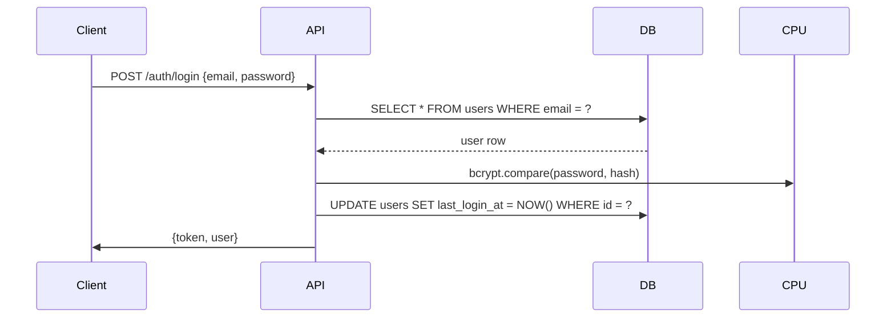
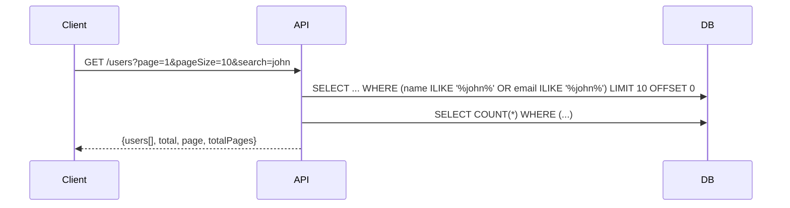

# Analise de Modelagem de Dados - Boilerplate

## Sumario Executivo

Este relatorio apresenta uma analise completa da modelagem de dados e arquitetura de banco de dados do projeto boilerplate, que inclui **3 variantes** de aplicacoes:

1. **Backend Boilerplate** (`/backend-boilerplate`) - API REST com Fastify + Prisma + Redis + BullMQ + Socket.IO
2. **Next.js API REST** (`/nextjs-api-rest`) - API completa com Next.js API Routes + Prisma + NextAuth + JWT
3. **Next.js Boilerplate** (`/nextjs-boilerplate`) - Front-end Next.js com autenticacao via NextAuth + Prisma Adapter

---

## 1. Schemas do Prisma

### 1.1 Backend Boilerplate Schema

**Arquivo:** `/backend-boilerplate/prisma/schema.prisma`

#### Modelo User

```prisma
model User {
  id          String    @id @default(cuid())
  email       String    @unique
  name        String?
  password    String
  role        UserRole  @default(USER)
  isActive    Boolean   @default(true) @map("is_active")
  lastLoginAt DateTime? @map("last_login_at")
  createdAt   DateTime  @default(now()) @map("created_at")
  updatedAt   DateTime  @updatedAt @map("updated_at")

  @@map("users")
}
```

**Caracteristicas:**
- **ID:** String CUID (identificador unico universal)
- **Email:** Campo unico para autenticacao
- **Nome:** Opcional (nullable)
- **Senha:** Armazenada com hash bcrypt
- **Role:** Enum (ADMIN, USER) com default USER
- **isActive:** Flag para soft delete/desativacao
- **lastLoginAt:** Timestamp do ultimo login
- **Timestamps:** createdAt e updatedAt automaticos

#### Enum UserRole

```prisma
enum UserRole {
  ADMIN
  USER
}
```

---

### 1.2 Next.js API REST Schema

**Arquivo:** `/nextjs-api-rest/prisma/schema.prisma`

Este schema e mais completo e inclui modelos para autenticacao com NextAuth:

#### Modelo User

```prisma
model User {
  id            String    @id @default(cuid())
  name          String?
  email         String    @unique
  emailVerified DateTime?
  image         String?
  password      String?
  role          String    @default("user")
  accounts      Account[]
  sessions      Session[]
  createdAt     DateTime  @default(now())
  updatedAt     DateTime  @updatedAt

  @@map("users")
}
```

**Observacoes:**
- `emailVerified`: Para verificacao de email
- `image`: URL da foto de perfil (OAuth)
- `password`: Opcional (para login via OAuth)
- `role`: Armazenado como String (nao enum tipado)
- Relacionamentos 1-N com Account e Session

#### Modelo Account

```prisma
model Account {
  id                String   @id @default(cuid())
  userId            String
  type              String
  provider          String
  providerAccountId String
  refresh_token     String?
  access_token      String?
  expires_at        Int?
  token_type        String?
  scope             String?
  id_token          String?
  session_state     String?

  user User @relation(fields: [userId], references: [id], onDelete: Cascade)

  @@unique([provider, providerAccountId])
  @@map("accounts")
}
```

**Caracteristicas:**
- Suporte a multiplos provedores OAuth (Google, GitHub, etc.)
- `onDelete: Cascade` - deleta contas quando usuario e removido
- Indice unico composto: `(provider, providerAccountId)`

#### Modelo Session

```prisma
model Session {
  id           String   @id @default(cuid())
  sessionToken String   @unique
  userId       String
  expires      DateTime
  user         User     @relation(fields: [userId], references: [id], onDelete: Cascade)

  @@map("sessions")
}
```

**Caracteristicas:**
- Token de sessao unico
- Relacao com User com cascade delete

#### Modelo VerificationToken

```prisma
model VerificationToken {
  identifier String
  token      String   @unique
  expires    DateTime

  @@unique([identifier, token])
  @@map("verificationtokens")
}
```

**Caracteristicas:**
- Para verificacao de email
- Indice unico composto: `(identifier, token)`

---

### 1.3 Next.js Boilerplate Schema

**Arquivo:** `/nextjs-boilerplate/prisma/schema.prisma`

Schema identico ao Backend Boilerplate (apenas modelo User):

```prisma
model User {
  id          String    @id @default(cuid())
  email       String    @unique
  name        String?
  password    String
  role        UserRole  @default(USER)
  isActive    Boolean   @default(true) @map("is_active")
  lastLoginAt DateTime? @map("last_login_at")
  createdAt   DateTime  @default(now()) @map("created_at")
  updatedAt   DateTime  @updatedAt @map("updated_at")

  @@map("users")
}

enum UserRole {
  ADMIN
  USER
}
```

---

## 2. Analise Comparativa dos Schemas

| Caracteristica | Backend Boilerplate | Next.js API REST | Next.js Boilerplate |
|---------------|---------------------|------------------|---------------------|
| Provider DB   | PostgreSQL          | PostgreSQL       | PostgreSQL          |
| Modelos       | 1 (User) + 1 Enum   | 4 (User, Account, Session, VerificationToken) | 1 (User) + 1 Enum |
| Auth          | JWT custom          | NextAuth + JWT   | NextAuth            |
| @@index       | Nenhum definido     | Implicito nos @unique | Nenhum definido |
| Soft Delete   | isActive flag       | Nao implementado | isActive flag       |

---

## 3. Diagrama de Entidades-Relacionamento (ASCII)

### Backend Boilerplate / Next.js Boilerplate

```
┌─────────────────────────────────────────────┐
│                     USER                     │
├─────────────────────────────────────────────┤
│ id: String (PK, CUID)                       │
│ email: String (UNIQUE)                      │
│ name: String (nullable)                     │
│ password: String                            │
│ role: UserRole (ADMIN/USER)                 │
│ isActive: Boolean (default: true)          │
│ lastLoginAt: DateTime (nullable)           │
│ createdAt: DateTime (default: now())        │
│ updatedAt: DateTime (auto-update)          │
└─────────────────────────────────────────────┘
```

### Next.js API REST (com NextAuth)

```
┌─────────────────────────────────────────────────────────────┐
│                          USER                                │
├─────────────────────────────────────────────────────────────┤
│ id: String (PK, CUID)                                       │
│ name: String (nullable)                                     │
│ email: String (UNIQUE)                                      │
│ emailVerified: DateTime                                     │
│ image: String                                               │
│ password: String (nullable)                                │
│ role: String (default: "user")                             │
│ createdAt: DateTime                                         │
│ updatedAt: DateTime                                        │
└─────────────────────────────────────────────────────────────┘
                              │ 1
                              │
                              ▼ N
┌───────────────────────────────────────────────────────────┐
│                        ACCOUNT                             │
├───────────────────────────────────────────────────────────┤
│ id: String (PK, CUID)                                     │
│ userId: String (FK → User.id, onDelete: Cascade)         │
│ type: String                                              │
│ provider: String                                          │
│ providerAccountId: String                                 │
│ refresh_token: String (nullable)                          │
│ access_token: String (nullable)                           │
│ expires_at: Int (nullable)                                │
│ token_type: String (nullable)                             │
│ scope: String (nullable)                                  │
│ id_token: String (nullable)                               │
│ session_state: String (nullable)                          │
│                                                            │
│ @@unique([provider, providerAccountId])                   │
└───────────────────────────────────────────────────────────┘

┌───────────────────────────────────────────────────────────┐
│                       SESSION                              │
├───────────────────────────────────────────────────────────┤
│ id: String (PK, CUID)                                     │
│ sessionToken: String (UNIQUE)                             │
│ userId: String (FK → User.id, onDelete: Cascade)         │
│ expires: DateTime                                         │
└───────────────────────────────────────────────────────────┘

┌───────────────────────────────────────────────────────────┐
│                  VERIFICATION TOKEN                        │
├───────────────────────────────────────────────────────────┤
│ identifier: String                                        │
│ token: String (UNIQUE)                                    │
│ expires: DateTime                                         │
│                                                            │
│ @@unique([identifier, token])                             │
└───────────────────────────────────────────────────────────┘
```

---

## 4. Relacionamentos

### Backend Boilerplate e Next.js Boilerplate
- **Entidade unica:** User
- **Nenhum relacionamento externo** - modelo simples e isolado

### Next.js API REST
- **User 1-N Account:** Um usuario pode ter multiplas contas OAuth
- **User 1-N Session:** Um usuario pode ter multiplas sessoes ativas
- **Cascade delete:** Delecao de usuario remove automaticamente contas e sessoes

---

## 5. Mapeamento de Colunas (@map)

Os schemas usam `@map` para mapear nomes de colunas em formato camelCase para snake_case no banco:

| Campo Prisma    | Nome no Banco (snake_case) |
|-----------------|----------------------------|
| `isActive`      | `is_active`                |
| `lastLoginAt`   | `last_login_at`            |
| `createdAt`     | `created_at`               |
| `updatedAt`     | `updated_at`               |

---

## 6. Configuracao do PrismaClient

### Backend Boilerplate

**Arquivo:** `/backend-boilerplate/src/lib/prisma.ts`

```typescript
const globalForPrisma = globalThis as unknown as {
  prisma: PrismaClient | undefined;
};

export const prisma =
  globalForPrisma.prisma ??
  new PrismaClient({
    log:
      process.env.NODE_ENV === 'development'
        ? ['query', 'error', 'warn']
        : ['error'],
    datasources: {
      db: {
        url: finalUrl, // com connection_limit=50&pool_timeout=20
      },
    },
    errorFormat: 'minimal',
  });
```

**Configuracoes criticas:**
- **Pool de conexoes:** `connection_limit=50`
- **Pool timeout:** `pool_timeout=20` (segundos)
- **Logging:** Apenas erros em producao; query, error, warn em dev
- **Singleton:** Reutiliza instancia global em dev (evita multiplas conexoes)

### Next.js API REST

**Arquivo:** `/nextjs-api-rest/src/lib/prisma.ts`

```typescript
export const prisma = globalForPrisma.prisma ?? new PrismaClient();

if (process.env.NODE_ENV !== 'production') globalForPrisma.prisma = prisma;
```

- Configuracao mais simples (sem parametros customizados de pool)

### Next.js Boilerplate

**Arquivo:** `/nextjs-boilerplate/src/lib/prisma.ts`

Identico ao Next.js API REST.

---

## 7. Consultas ao Banco de Dados

### 7.1 Autenticacao (Login)

#### Backend Boilerplate

**Arquivo:** `/backend-boilerplate/src/http/routes/auth/authenticate.ts`

```typescript
// 1. Buscar usuario por email
const user = await prisma.user.findUnique({
  where: { email },
  select: {
    id: true,
    name: true,
    email: true,
    password: true,
    isActive: true,
  },
});

// 2. Verificar senha com bcrypt
const isPasswordValid = await compare(password, user.password);

// 3. Atualizar lastLoginAt
await prisma.user.update({
  where: { id: user.id },
  data: { lastLoginAt: new Date() },
});
```

**Query SQL equivalente:**
```sql
-- SELECT
SELECT id, name, email, password, is_active
FROM users
WHERE email = $1
LIMIT 1;

-- UPDATE
UPDATE users
SET last_login_at = NOW()
WHERE id = $1;
```

#### Next.js API REST

**Arquivos:** `nextjs-api-rest/src/lib/auth.ts` (NextAuth)

- Usa PrismaAdapter do NextAuth para gerenciar usuarios, contas e sessoes
- Metodo `authorize` busca usuario por email e valida senha

```typescript
const user = await prisma.user.findUnique({
  where: { email },
});

const isPasswordValid = await bcrypt.compare(password, user.password);
```

---

### 7.2 CRED Usuario

#### CREATE

**Backend Boilerplate** - `/backend-boilerplate/src/http/routes/user/create-user.ts`

```typescript
// 1. Verificar email unico
const userWithSameEmail = await prisma.user.findUnique({
  where: { email },
});

// 2. Criar usuario com hash
const user = await prisma.user.create({
  data: {
    name,
    email,
    password: passwordHash,
    role,
  },
  select: {
    id: true,
    name: true,
    email: true,
    role: true,
    isActive: true,
    createdAt: true,
  },
});
```

**Query SQL:**
```sql
INSERT INTO users (id, name, email, password, role, is_active, created_at)
VALUES ($1, $2, $3, $4, $5, true, NOW())
RETURNING id, name, email, role, is_active, created_at;
```

**Next.js API REST** - `/nextjs-api-rest/src/lib/services/user-service.ts`

```typescript
async create(data: CreateUserInput) {
  const existingUser = await prisma.user.findUnique({
    where: { email: data.email },
  });
  if (existingUser) throw new Error('Usuário com este email já existe');

  const user = await prisma.user.create({
    data: {
      name: data.name,
      email: data.email,
      password: passwordHash,
      role: data.role,
    },
    select: {
      id: true,
      name: true,
      email: true,
      role: true,
      isActive: true,
      createdAt: true,
    },
  });
  return user;
}
```

---

#### READ (by ID)

```typescript
const user = await prisma.user.findUnique({
  where: { id },
  select: {
    id: true,
    name: true,
    email: true,
    role: true,
    isActive: true,
    lastLoginAt: true,
    createdAt: true,
    updatedAt: true,
  },
});
```

**Query SQL:**
```sql
SELECT id, name, email, role, is_active, last_login_at, created_at, updated_at
FROM users
WHERE id = $1
LIMIT 1;
```

---

#### READ (List with Pagination)

**Backend Boilerplate** - `/backend-boilerplate/src/http/routes/user/list-users.ts`

```typescript
const where: any = {};

if (role) where.role = role;
if (typeof isActive === 'boolean') where.isActive = isActive;
if (search) {
  where.OR = [
    { name: { contains: search, mode: 'insensitive' } },
    { email: { contains: search, mode: 'insensitive' } },
  ];
}

// Parallel execution for performance
const [users, total] = await Promise.all([
  prisma.user.findMany({
    where,
    select: { id: true, name: true, email: true, role: true, isActive: true, lastLoginAt: true, createdAt: true },
    skip: (page - 1) * pageSize,
    take: pageSize,
    orderBy: { createdAt: 'desc' },
  }),
  prisma.user.count({ where }),
]);

const totalPages = Math.ceil(total / pageSize);
```

**Query SQL:**
```sql
-- List
SELECT id, name, email, role, is_active, last_login_at, created_at
FROM users
WHERE (role = $1 OR is_active = $2) OR (name ILIKE $3 OR email ILIKE $4)
ORDER BY created_at DESC
OFFSET $5
LIMIT $6;

-- Count
SELECT COUNT(*) FROM users WHERE (...mesmas condicoes...);
```

---

#### UPDATE

```typescript
// 1. Buscar usuario existente
const existingUser = await prisma.user.findUnique({
  where: { id },
});

// 2. Verificar email unico se alterado
if (email && email !== existingUser.email) {
  const userWithEmail = await prisma.user.findUnique({
    where: { email },
  });
  if (userWithEmail) throw new Error('Email já está em uso');
}

// 3. Atualizar
const user = await prisma.user.update({
  where: { id },
  data: updateData,
  select: {
    id: true,
    name: true,
    email: true,
    role: true,
    isActive: true,
    updatedAt: true,
  },
});
```

**Query SQL:**
```sql
UPDATE users
SET name = $1, email = $2, role = $3, is_active = $4, password = $5, updated_at = NOW()
WHERE id = $6
RETURNING id, name, email, role, is_active, updated_at;
```

---

#### DELETE

```typescript
// Soft delete nao implementado - DELETE hard
await prisma.user.delete({
  where: { id },
});
```

**Query SQL:**
```sql
DELETE FROM users WHERE id = $1;
```

---

### 7.3 NextAuth Operations

**Arquivo:** `/nextjs-api-rest/src/lib/auth.ts`

#### Login (Credentials)
```typescript
const user = await prisma.user.findUnique({
  where: { email },
});
// retorna { id, name, email, image, role } se valido
```

#### PrismaAdapter
O `PrismaAdapter(prisma)` gerencia:
- `createUser()`
- `getUser()`
- `updateUser()`
- `deleteUser()`
- `linkAccount()`
- `unlinkAccount()`
- `createSession()`, `getSessionAndUser()`, `updateSession()`, `deleteSession()`
- `createVerificationToken()`, `useVerificationToken()`

---

### 7.4 Next.js Boilerplate Auth

**Arquivo:** `/nextjs-boilerplate/src/app/api/auth/register/route.ts`

```typescript
const existingUser = await prisma.user.findUnique({
  where: { email },
});

if (existingUser) return NextResponse.json({ error: 'User already exists' }, { status: 400 });

const hashedPassword = await bcrypt.hash(password, 10);

const user = await prisma.user.create({
  data: {
    email,
    name,
    password: hashedPassword,
  },
});
```

---

## 8. Middleware de Autenticacao

### Backend Boilerplate

**Arquivo:** `/backend-boilerplate/src/middlewares/auth.ts`

```typescript
export const auth = fastifyPlugin(async (app: FastifyInstance) => {
  app.addHook('preHandler', async (request: FastifyRequest) => {
    request.getCurrentUserId = async () => {
      const { sub } = await request.jwtVerify<{ sub: string }>();
      return sub;
    };
    request.getCurrentUserRole = async () => {
      const decoded = await request.jwtVerify<{ sub: string; role?: string }>();
      return decoded.role || 'USER';
    };
  });
});
```

**Fluxo:**
1. Verifica JWT via `request.jwtVerify()`
2. Disponibiliza `getCurrentUserId()` e `getCurrentUserRole()`
3. Rotas usam `app.register(auth)` para protecao

---

## 9. Transacoes e Operacoes em Lote

### Analise de Uso

**Nenhuma transacao explicita foi encontrada no codigo fonte.**

Operacoes em lote nao utilizadas:
- `createMany()`, `updateMany()`, `deleteMany()` - nao encontrados
- `$transaction()` - nao implementado

### Implicacoes

1. **Cada operacao e independente** - nao ha atomicidade entre multiplas queries
2. **Cenario critico (Backend):** Atualizacao de `lastLoginAt` apos autenticacao
   - Se usuario nao existir: commit parcial (erro)
   - Se `UPDATE` falhar: login ja retornou token (inconsistencia)
3. **Recomendacao:** Envolver operacoes criticas em `$transaction()` quando houver dependencia

---

## 10. Indices e Performance

### Indices Disponiveis (generated by Prisma)

#### Backend / Next.js Boilerplate
```sql
-- Primary Key
CREATE UNIQUE INDEX users_pkey ON public.users USING btree (id);

-- Unique constraint
CREATE UNIQUE INDEX users_email_key ON public.users USING btree (email);

-- Mapped columns (via @map)
CREATE INDEX users_is_active_idx ON public.users USING btree (is_active);
CREATE INDEX users_created_at_idx ON public.users USING btree (created_at);
-- Nota: Indexes para 'role' e 'last_login_at' NAO foram definidos explicitamente
```

#### Next.js API REST
```sql
CREATE UNIQUE INDEX users_pkey ON public.users USING btree (id);
CREATE UNIQUE INDEX users_email_key ON public.users USING btree (email);

CREATE UNIQUE INDEX accounts_provider_providerAccountId_key ON public.accounts USING btree (provider, provideraccountid);
CREATE UNIQUE INDEX sessions_sessionToken_key ON public.sessions USING btree (sessiontoken);

-- onDelete: Cascade - indices estrangeiros automaticos
```

### Indices Faltantes (Recomendados)

| Coluna | Uso | Indice Recomendado |
|--------|-----|-------------------|
| `role` | Filtros em listUsers | `@@index([role])` |
| `is_active` | Filtros | `@@index([is_active])` |
| `last_login_at` | Queries de atividade | `@@index([last_login_at])` |
| `(email, password)` | Login acceleration | `@@index([email, password])` |

**Impacto da falta de indices:**
- Queries de listagem com filtros por `role` e `isActive` fazem full table scan
- Busca por email usa indice unico (ja otimizado)
- Performance degrada conforme crescimento do numero de usuarios

---

## 11. Validações no Banco

### Restriçoes Definidas

| Restricao | Tipo | Aplicacao |
|-----------|------|-----------|
| `@id` | Primary Key | Todas as tabelas |
| `@unique` | Unique constraint | email (users), provider+providerAccountId (accounts), sessionToken (sessions) |
| `@default(cuid())` | Default UUID v4 | IDs de todas as entidades |
| `@default(now())` | Timestamp | createdAt |
| `@updatedAt` | Auto update | updatedAt |
| `@map()` | Column mapping | snake_case no banco |

### Validaçoes NÃO Existentes

- **Check constraints:** Nenhum CHECK definido (ex: email precisa conter '@')
- **Foreign Keys:** Nenhum FK explicitado alem dos relacionamentos Prisma
- **NOT NULL:** Campos opcionais (`String?`) permitem NULL

---

## 12. Bancos de Dados Suportados

Todos os schemas usam:

```prisma
datasource db {
  provider = "postgresql"
  url      = env("DATABASE_URL")
}
```

**PostgreSQL** - invoice choices:
- Robustez para relacoes e constraints
- Suporte a ILIKE (case-insensitive search)
- Suporte a tipos JSON/JSONB (nao utilizado)
- Transacoes ACID

**Nao sao utilizados:** MySQL, SQLite, SQL Server, CockroachDB

---

## 13. Seeds de Dados

### Backend Boilerplate Seed

**Arquivo:** `/backend-boilerplate/prisma/seed.ts`

```typescript
async function main() {
  // Admin user
  const adminPassword = await hash('admin123', 10);
  await prisma.user.upsert({
    where: { email: 'admin@example.com' },
    update: {},
    create: {
      email: 'admin@example.com',
      name: 'Admin User',
      password: adminPassword,
      role: 'ADMIN',
    },
  });

  // Regular user
  const userPassword = await hash('user123', 10);
  await prisma.user.upsert({
    where: { email: 'user@example.com' },
    update: {},
    create: {
      email: 'user@example.com',
      name: 'Regular User',
      password: userPassword,
      role: 'USER',
    },
  });
}
```

**Usuarios seedados:**
| Email | Senha | Role |
|-------|-------|------|
| admin@example.com | admin123 | ADMIN |
| user@example.com | user123 | USER |

### Next.js API REST Seed

**Arquivo:** `/nextjs-api-rest/prisma/seed.ts`

Identico ao anterior, com dominios `@99freela.com`:
- `admin@99freela.com` / `admin123` (ADMIN)
- `user@99freela.com` / `user123` (USER)

### Problemas de Segurança

- **Senhas hardcoded:** Senhas em texto claro no codigo
- **Bcrypt rounds:** 10 rounds (atualmente aceitavel, mas 12+ recomendado)
- **Sem senha forte:** `admin123` e `user123` sao fracas
- **Recomendacao:** Gerar senhas randomicas ou forcar change-on-first-login

---

## 14. Migrations

### Situacao Atual

**Nenhum diretorio `/prisma/migrations` encontrado.**

```
❌ backend-boilerplate/prisma/migrations - NAO EXISTE
❌ nextjs-api-rest/prisma/migrations - NAO EXISTE
❌ nextjs-boilerplate/prisma/migrations - NAO EXISTE
```

### Implicacoes

1. **Schema sync via `db:push`** - mudancas aplicadas diretamente sem versionamento
2. **Sem rollback** - nao ha como reverter migrations
3. **Sem historico** - impossivel recriar estado anterior
4. **Problemas em producao:**
   - Diferencas entre ambientes nao controladas
   - Concorrencia de mudancas de schema
   - Impossivel aplicar changes em instancias existentes

### Recomendacao

```bash
# Inicializar migrations
npx prisma migrate dev --name init

# Commits:
# backend-boilerplate/prisma/migrations/YYYYMMDDHHMMSS_init/
```

---

## 15. Pontos de Gargalo e Riscos

### CRITICOS

| # | Risco | Impacto | Localizacao |
|---|-------|---------|-------------|
| 1 | **Ausencia de indices** | performance degrade com crescimento | Todos os projetos |
| 2 | **Sem transacoes** | inconsistencia de dados | Backend Boilerplate (login) |
| 3 | **Sem migrations** | Sem versionamento de schema | Todos os projetos |
| 4 | **DELETE hard** | Perda de dados irreversivel | CRUD de usuarios |
| 5 | **Senhas no seed** | Credenciais padrao em prod | seed.ts |

### MEDIOS

| # | Risco | Impacto |
|---|-------|---------|
| 6 | `role` como String | Sem约束 de tipo (risk de typo: 'admi', 'Usr') |
| 7 | Pool limit fixado | 50 conexoes pode ser insuficiente em alta carga |
| 8 | `LIKE` sem index | Queries de search sao O(n) |
| 9 | Soft delete nao implementado | Delecao irreversivel |

### BAIXOS

| # | Risco | Impacto |
|---|-------|---------|
| 10 | Campos `String?` sem validacao | Dados incompletos |
| 11 | Sem audit log | Impossivel rastrear alteracoes |

---

## 16. Acesso ao Banco (Repository Pattern)

### Arquitetura Atual

**Backend Boilerplate** - Sem camada de repository:
```
Routes (HTTP handlers) → PrismaClient direto
```

**Next.js API REST** - Service Layer:
```
Routes (API handlers) → UserService → PrismaClient
```

### Estrutura de Services (Next.js API REST)

```
src/lib/services/user-service.ts
├── create(data)
├── findById(id)
├── findByEmail(email)
├── list(query)
├── update(id, data)
├── delete(id)
└── authenticate(email, password)
```

**Vantagens:**
- Encapsulamento de logica de negocio
- Reutilizacao de codigo
- Facilidade de testes
- Troca de ORM/DB em um ponto

**Backend Boilerplate** poderia adotar padrao similar.

---

## 17. Consultas Criticas

### 17.1 Fluxo de Login



**Tempo total:** ~2-3 RTT ao banco (SELECT + UPDATE)
**Melhoria possivel:** Combinar em uma transacao ou usar `RETURNING`

---

### 17.2 Listagem de Usuarios



**Problema:** Sem indices, busca por `name`/`email` com `ILIKE '%...%'` faz full scan
**Sugestao:** usar `@@index([name, email])` ou `pg_trgm` extension

---

### 17.3 Criacao de Usuario

```mermaid
sequenceDiagram
    Client->>API: POST /users {email, ...}
    API->>DB: SELECT * FROM users WHERE email = ?
    alt exists
        DB-->>API: user
        API-->>Client: 409 CONFLICT
    else not exists
        DB-->>API: empty
        API->>CPU: bcrypt.hash(password)
        API->>DB: INSERT INTO users (...) VALUES (...) RETURNING ...
        DB-->>API: new user
        API-->>Client: 201 {user}
```

**Tempo:** 2 queries (SELECT + INSERT)
**Race condition possivel:** Dois requests simultaneos podem criar usuario duplicado
**Solucao:** Rely na constraint UNIQUE + catch duplicate error, ou advisory lock

---

## 18. Recomendacoes de Melhoria

### Urgentes

1. **Adicionar indices:**
```prisma
@@index([role])
@@index([isActive])
@@index([lastLoginAt])
@@index([createdAt])
@@index([email, password]) // compound para login
```

2. **Implementar soft delete:**
```prisma
model User {
  deletedAt DateTime? @map("deleted_at")
  // isActive removido ou convertido para view
}
```

3. **Inicializar migrations:**
```bash
npx prisma migrate dev --name init_schema
```

4. **Encerrar transacoes em operacoes criticas:**
```typescript
await prisma.$transaction(async (tx) => {
  const user = await tx.user.findUnique(...);
  await tx.user.update(...);
});
```

### Medioprazo

5. **Audit log:** Tabela `audit_logs` com `userId, action, oldData, newData, timestamp`
6. **Role como enum tipado** em todos os projetos
7. **Email validation** (CHECK constraint)
8. **Password strength validation** no schema
9. **Session management** - limpar sessoes expiradas (cron job)
10. **Prepared statements** - Prisma ja usa, mas monitorar cache

### Longo prazo

11. **Multi-tenancy** (schema por empresa)
12. **Sharding strategy** (se usuarios > 1M)
13. **Read replicas** para queries de listagem
14. **Database connection pool tuning** (pgbouncer)

---

## 19. Resumo de Arquivos Relevantes

### Backend Boilerplate

| Caminho | Funcao |
|---------|--------|
| `/prisma/schema.prisma` | Modelo User + UserRole enum |
| `/prisma/seed.ts` | Seeds de admin/user |
| `/src/lib/prisma.ts` | Configuracao do PrismaClient (pool 50, log) |
| `/src/http/routes/auth/authenticate.ts` | Login (SELECT + UPDATE) |
| `/src/http/routes/user/*.ts` | CRUD completo |
| `/src/middlewares/auth.ts` | Middleware de autenticacao JWT |
| `/server.ts` | Configuracao completa (Redis, BullMQ, Socket.IO) |

### Next.js API REST

| Caminho | Funcao |
|---------|--------|
| `/prisma/schema.prisma` | User + Account + Session + VerificationToken |
| `/prisma/seed.ts` | Seeds admin/user |
| `/src/lib/prisma.ts` | PrismaClient singleton |
| `/src/lib/auth.ts` | NextAuth config + PrismaAdapter |
| `/src/lib/services/user-service.ts` | Service layer com todas as operacoes |
| `/src/lib/auth-middleware.ts` | Middleware de autenticacao |
| `/src/app/api/auth/*` | Rotas de autenticacao |

### Next.js Boilerplate

| Caminho | Funcao |
|---------|--------|
| `/prisma/schema.prisma` | Modelo User + UserRole |
| `/src/lib/prisma.ts` | PrismaClient singleton |
| `/src/lib/auth.ts` | NextAuth config |
| `/src/app/api/auth/register/route.ts` | Registro de usuarios |

---

## 20. Conclusao

O projeto apresenta uma **base solida** de autenticacao com Prisma + PostgreSQL, mas carece de otimizacoes essenciais para producao:

### Pontos Fortes
- Tipagem TypeScript completa via Prisma Client
- Bcrypt para hashing de senhas
- Padroes RESTful
- Middlewares de autenticacao claros
- Service layer em Next.js API REST
- Suporte a OAuth via NextAuth (nextjs-api-rest)

### Pontos Fracos
- **Falta de indices** para colunas de filtro (performance critica)
- **Ausencia de migrations** versionadas
- **Nenhuma transacao** em operacoes com multiplas queries
- **DELETE hard** sem recuperacao
- **Senhas fracas** nos seeds

### Prioridade de Acao

1. **Alta:** Adicionar indices em `role`, `is_active`, `created_at`
2. **Alta:** Inicializar sistema de migrations
3. **Media:** Implementar soft delete
4. **Media:** Converter `role` para enum em todos os projetos
5. **Baixa:** Audit log, multi-tenancy

---

**Gerado em:** 2026-03-14
**Analisador:** Claude (Anthropic)
**Projeto:** `/workspace/temp-orquestrador/users/5aaf347f-952f-4355-8513-ac3f4024b43e/projetos/boilerplate`
